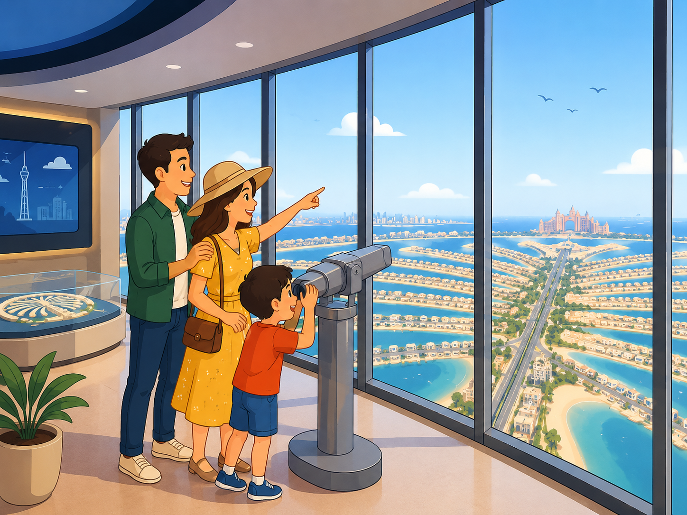
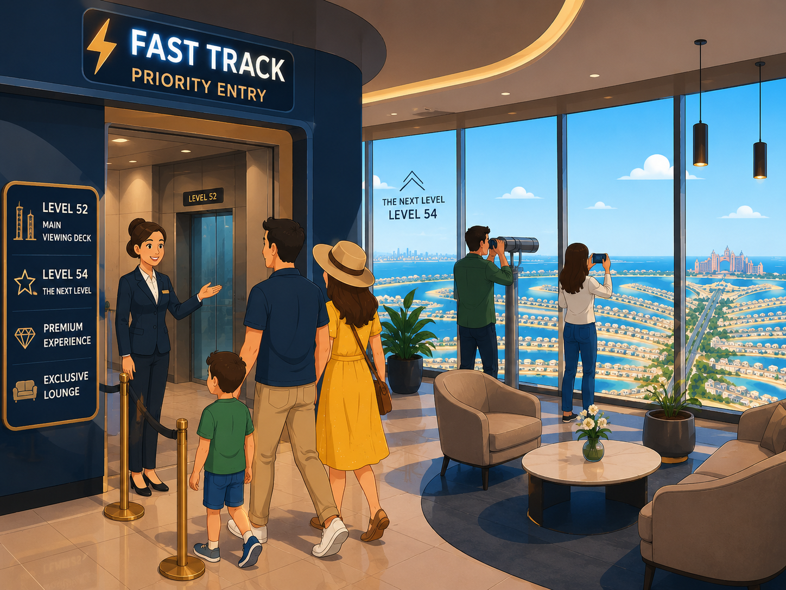
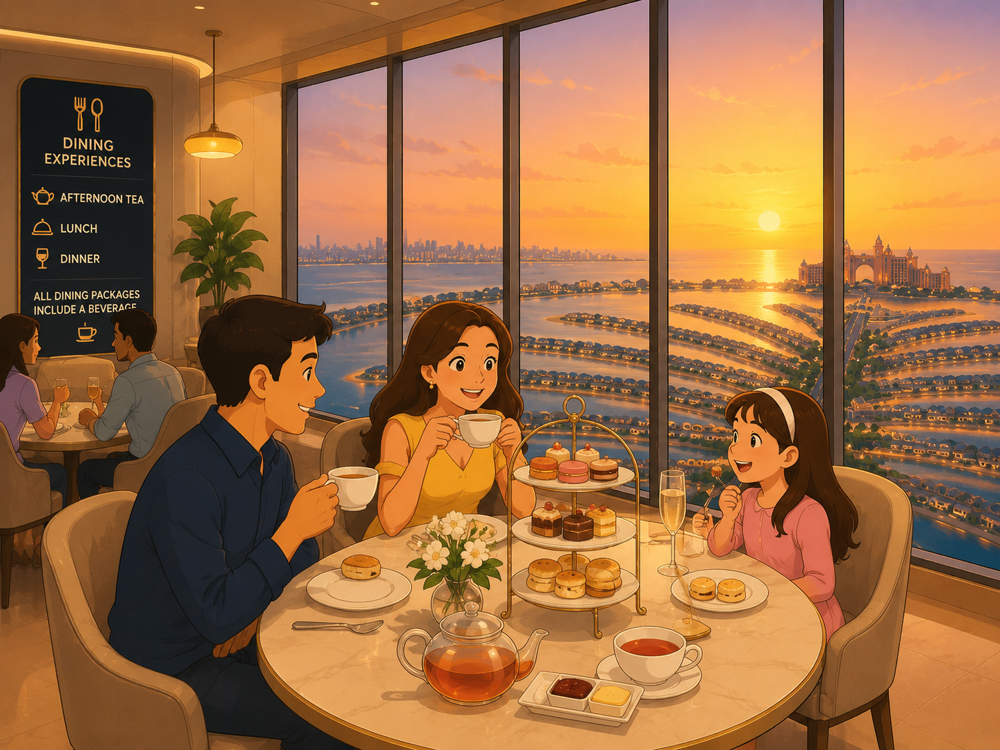
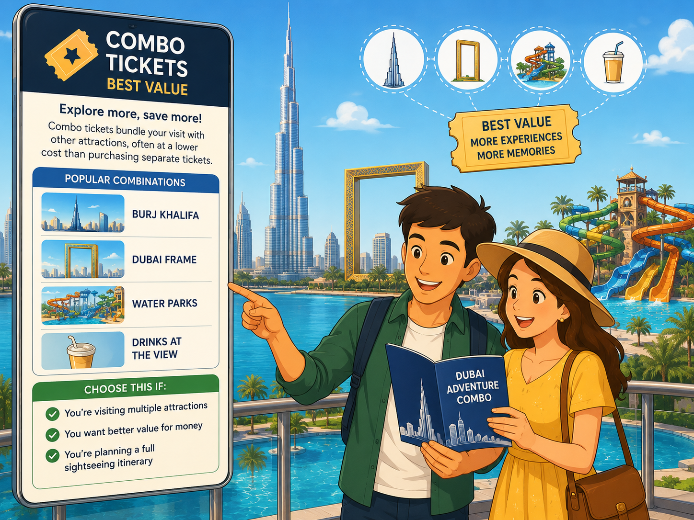
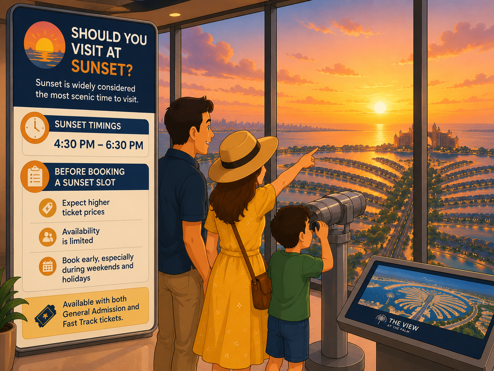

# 🌴 The View at The Palm: Which Ticket Should You Book?

> **Not sure which ticket to choose? Here's a simple guide to help you find the right option.**

---

###  1. General Admission

<table>
<tr>
<td width="50%" align="center" valign="middle">

</td>
<td width="60%" valign="top">

#### What's included?

- Access to Level 52
- Interactive exhibits
- Immersive theatre experience
- Observation deck with panoramic views

#### Choose this ticket if:

✅ You want the standard View at The Palm experience

✅ You're travelling with family

✅ You're looking for the most budget-friendly option

</td>
</tr>
</table>

> **✨ Best for first-time visitors**

---

### 2. Fast Track + The Next Level

<table>
<tr>
<td width="50%" align="center" valign="middle">

</td>
<td width="60%" valign="top">

#### What's included?

- Priority entry
- Access to Level 52
- Access to Level 54 - the highest viewing point
- Premium viewing area
- Exclusive lounge

#### Choose this ticket if:

✅ You're visiting during busy hours

✅ You want the highest viewpoint available

✅ You love photography and skyline views

</td>
</tr>
</table>

> **✨ Don't want to spend time waiting in queues**

---

### 3. Dining Experiences

<table>
<tr>
<td width="50%" align="center" valign="middle">

</td>
<td width="60%" valign="top">

#### Available Experiences

- Afternoon Tea
- Lunch (adults only)
- Dinner (adults only)

All dining packages include a beverage.

#### Choose this ticket if:

✅ You're celebrating a special occasion

✅ You want a relaxed experience

✅ You enjoy dining with a view

**Tip:** Afternoon Tea is one of the most popular choices for sunset visits.

</td>
</tr>
</table>

> **✨ More than just the views**

---

### 4. Combo Tickets

<table>
<tr>
<td width="50%" align="center" valign="middle">

</td>
<td width="60%" valign="top">
  
#### Popular combinations

- Burj Khalifa
- Dubai Frame
- Water Parks
- Drinks at The View

#### Choose this ticket if:

✅ You're visiting multiple attractions

✅ You want better value for money

✅ You're planning a full day of sightseeing

</td>
</tr>
</table>

> **✨ Planning to visit other attractions during your trip**

---

### 🌅 Visiting at Sunset

<table>
<tr>
<td width="50%" align="center" valign="middle">

</td>
<td width="60%" valign="top">

#### Sunset Hours

4:30 PM – 6:30 PM

#### Before you book

- Sunset tickets cost more than regular slots
- These tickets sell out quickly
- Book early if you're visiting on weekends or holidays

> Available with both General Admission and Fast Track tickets.

</td>
</tr>
</table>

> **✨ Most spectacular views of the day**

---

## 🤔 Still Not Sure?

| Travel Style | Recommended Ticket |
|--------------|-------------------|
| First-time visitor | 🏆 **General Admission** |
| Best views & priority access | ⚡ **Fast Track + The Next Level** |
| Special occasions & celebrations | 🍽️ **Dining Experience** |
| Exploring multiple Dubai attractions | 🎫 **Combo Ticket** |

---

## 📌 Things to Know Before Booking

- Ticket prices vary by date, day, and time slot.
- Weekend tickets are usually priced higher than weekday tickets.
- Sunset slots carry premium pricing and limited availability.
- Ticket inclusions and promotional offers may change over time.
- Always review the latest ticket details before booking.

---

## ✨ Current Offer: 
Adults purchasing General Admission or Fast Track + The Next Level tickets may be eligible for a complimentary child ticket (under 12 years). Check the latest offer details before booking.

---

## ⭐ Our Recommendation

For most visitors, **General Admission** offers the best balance of experience and value.

If you're visiting during sunset or want the highest viewpoint available, **Fast Track + The Next Level** is worth the upgrade.
